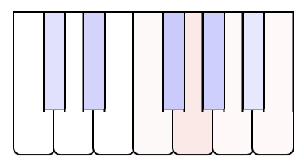

# LSTM Harmonizer
By Max Brynolf (max.brynolf@hotmail.com)

Repository link: https://github.com/MaxBrynolf/lstm-harmonizer

## Overview

A tool that allows you to train and test a harmonizing LSTM-model, which attempts to find appropriate chords to a melody in real time. The project includes an environment for training the model using MIDI-files, as well as a web application that allows you to test the model interactively.

## Installation
Requirements:
1. Python and Jupyter Lab/Jupyter Notebook
2. [Flask](https://github.com/pallets/flask)
3. [Music21](https://github.com/cuthbertLab/music21)
4. jQuery

Installation:
1. Install Flask with `pip install flask` and Music21 with `pip install music21`
2. Install PyTorch with `pip install torch`
3. Find a resource with piano sound samples and put the files in "harmonizer/static/sounds", renamed to note names (for instance "A4.mp3")
4. Go to "harmonizer/static/piano.js" and change `file_format` to whichever file format is used for the sound samples
5. Add "jquery.js" to "harmonizer/static"

## Usage
#### Training

The training is based on a set of MIDI-files in the MIDIs folder. The structure of the files should be:

> MIDIs/**data_family**/**file_identifier**_1.mid
> 
> MIDIs/**data_family**/**file_identifier**_2.mid
> 
> ...
> 
> MIDIs/**data_family**/**file_identifier**_n.mid

where **data_family** indicates a dataset family, for instance a specific composer or genre of music. The files inside the **data_family** folder is numerically ordered as **file_identifier**_1, **file_identifier**_2 and so on.

To train a model, launch the notebook "train.ipynb" using Jupyter. The instructions are given in the notebook. Cells are provided that save/load the model as "model.pt" in the base directory.

#### Testing

To test the trained model, first make sure that it is saved in the base directory as "model.pt". Then launch the Flask-application by opening the command prompt and redirecting to the base folder, then running the command:

```
flask --app harmonizer run
```

Open a web browser that supports playback of multiple sound elements (not Safari), such as Google Chrome, and go to the URL "127.0.0.1:5000". The server automatically uses the model "model.pt" saved in the base directory, and will find chords to your input melody accordingly.

## Example

The following example uses a training dataset based on classical music by Beethoven, Clementi, Grieg, Haydn, Mendelssohn, Mozart, Schubert and Schumann. The resulting model is tested in the video below, using the interactive web application. The samples used were based on [fuhton/piano-mp3](https://github.com/fuhton/piano-mp3/).

[](https://github.com/MaxBrynolf/lstm-harmonizer/assets/71834850/f9721428-0c87-45ab-ac0f-e822b7efbdfb)

The distribution of the data is shown below, with each composer corresponding to a data family.


The following shows a comparison of the model's performance during a sequence of falling fifths, which is a very common type of modulation. The example is taken from Schumann's first piano sonata and is chosen because the melody hints at a clear harmony without much ambiguity.

As can be seen, the model does not have enough context to find the first chord, but does manage to find a fitting second chord (Fm, which is similar to B♭9). One might argue that the only reason the model plays a C and an A♭ is because both of these notes appear in the input sequence. This isn't true however, because even with the C removed, the same chord is played, in which case it also includes more chord notes. The third chord is correctly identified, however with slight more dissonance than in the original. The fourth chord is also correct, even though it is lacking some notes that could make it clearer.

Origin                     |  Score
:-------------------------:|:-------------------------:
Original chords | <tr></tr>
Generated chords |  

The response of some of the output nodes of the first LSTM cell are shown below, when the input is a C-major scale followed by all the black notes. A red color indicates a positive response, and a blue color a negative response. As can be seen, some of the nodes react when the tonality is changed. For example, node 184 and 190, even though reacting slightly differently to different keys, both give a negative response when the first black key is introduced. Node 196, on the other hand, does the exact opposite. Most of the nodes do not give such an obvious response, and usually react to a certain range of keys. For example, node 110 reacts to some of the black keys, namely those associated with E♭ and B♭.

Input Sequence | Node 110 | Node 184 | Node 190 | Node 196
:-------------------------:|:-------------------------:|:-------------------------:|:-------------------------:|:-------------------------:
 |  |  |  | 
